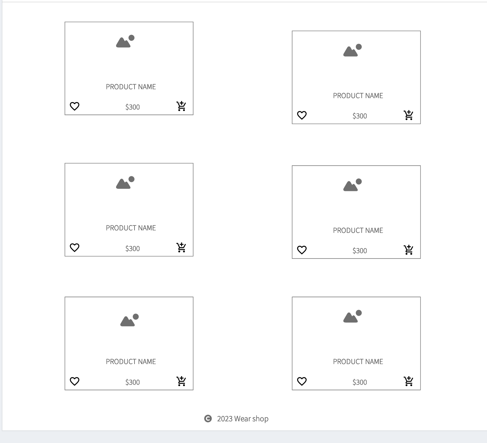

# Fashion Wear Shop App

https://wear-shop-part-b.vercel.app

## Project Overview

### R1: Description of your website

- **Purpose:** This web application is a fashion wear shop that allows users to browse and purchase clothes online.
- **Functionality/Features:**
  - Users can browse all available clothes.
  - Filter clothes by categories: Men, Women, Children.
  - Add items to Wishlist.
  - Add items to the shopping cart.
  - View the total cost of selected products.
- **Target Audience:** Fashion enthusiasts and shoppers looking for a convenient online shopping experience.
- **Tech Stack:**
  - Frontend: React
  - Backend: Node.js, Express
  - Database: MongoDB

## Project Documentation

### Dataflow Diagram

  

### Application Architecture Diagram

  

### Wireframes

  
  
  
  
  
  
  

### Screenshots of Trello Board

- 

## Deliverables

### README.md

- [README.md file]

### Resources

[Folder Structure]
- /
  - README.md
  - docs/
    - [Application Architecture Diagram](docs/Application_Architecture_Diagram.PNG)
    - [Dataflow Diagram](docs/DataFlow_Diagram.PNG)
    - [Trello Board Screenshot](docs/Trello_Screenshot.PNG)
    - [User Stories Document](docs/User-stories.docx)
    - [Wireframes](docs/Wireframes)

